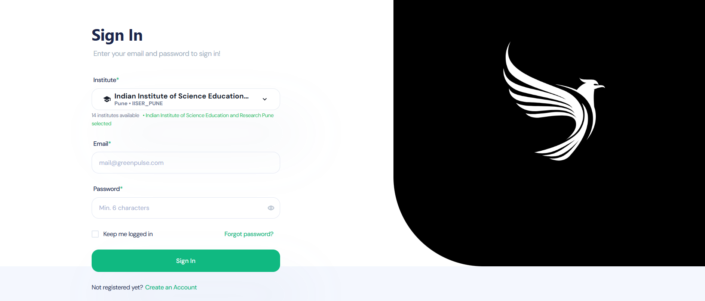
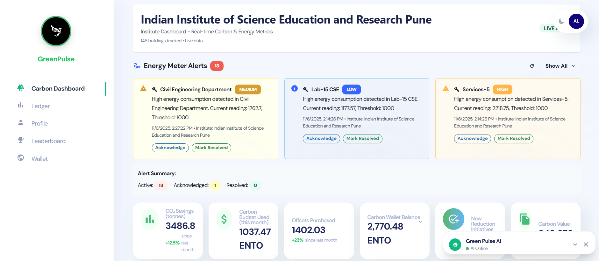
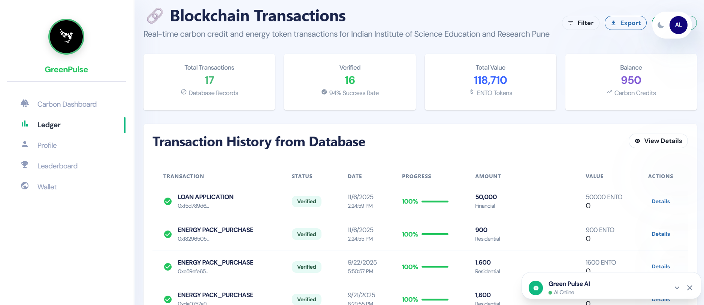

# Green Pulse - Energy Management Platform

## Overview

Green Pulse is a comprehensive energy management platform designed to help institutions monitor, analyze, and optimize their carbon footprint and energy consumption. The platform integrates blockchain technology for energy trading, a React-based gamified dashboard for data visualization, and an AI-powered chatbot for user assistance.

## Project Structure

- **Backend**: Node.js/Express API server with MongoDB database
- **Frontend**: React-based web application
- **Chatbot**: Python Flask service with Gemini AI integration
- **Contracts**: Solidity smart contracts for energy trading and carbon credits

## Tech Stack

### Backend
- Node.js & Express
- MongoDB with Mongoose ODM
- JWT Authentication
- RESTful API architecture

### Frontend
- React 18
- Chakra UI component library
- React Router for navigation
- Axios for API communication
- ApexCharts for data visualization

### Chatbot
- Python 3.10+
- Flask web framework
- Google Generative AI (Gemini)

### Blockchain
- Solidity smart contracts
- Hardhat development environment
- OpenZeppelin contract libraries
- Ethers.js for blockchain interaction

## Prerequisites

- Node.js (v16+)
- Python 3.10+
- MongoDB
- Docker and Docker Compose (for containerized deployment)

## Installation

### Local Development Setup

1. Clone the repository:
   ```bash
   git clone https://github.com/roysubhrajit113/green-pulse-final
   cd green-pulse-final
   ```

2. Install root project dependencies (in both frontend and backend):
   ```bash
   npm install
   ```

3. Set up environment variables:
   Create a `.env` file in the project root with the following variables:
   ```
   MONGODB_URI=your-mongodb-database
   JWT_SECRET=your_jwt_secret_key
   GEMINI_API_KEY=your_gemini_api_key
   ```

4. Follow the setup instructions in each component's README:
   - [Backend Setup](./backend/README.md)
   - [Frontend Setup](./frontend/README.md)
   - [Chatbot Setup](./chatbot/README.md)

### Docker Deployment

1. Make sure Docker and Docker Compose are installed on your system

2. Build and start the containers:
   ```bash
   docker-compose up -d
   ```

3. Access the services:
   - Backend API: http://localhost:5000
   - Frontend: http://localhost:3000
   - Chatbot service: http://localhost:5001

## Configuration

### Environment Variables

- `MONGODB_URI`: MongoDB connection string
- `JWT_SECRET`: Secret key for JWT token generation
- `GEMINI_API_KEY`: API key for Google's Gemini AI model
- `NODE_ENV`: Environment setting (development/production)

## Usage

### Running the Application

#### Development Mode

1. Start the backend server:
   ```bash
   cd backend
   npm run dev
   ```

2. Start the frontend development server:
   ```bash
   cd frontend
   npm start
   ```

3. Start the chatbot service:
   ```bash
   cd chatbot
   python main.py
   ```
4. Start the blockchain network:
   ```bash
   npm run hardhat node
   ```

#### Production Mode (Docker)

```bash
docker-compose up -d
```

### Smart Contract Deployment

1. Compile the contracts:
   ```bash
   npm run compile
   ```

2. Deploy to local network:
   ```bash
   npm run deploy
   ```


## Snapshots

### Login Page



### Dashboard



### Blockchain Ledger



